### Hi there 👋 I'm Jonas 😄

 

### About Me 🚀
💻 I’m a Full-stack developer with a bachelor's degree in Computer Engineering.   
💬 Feel more than welcome to contact me if you need any help or want to discuss any software development topic!   

## Kotlin

  <a href="https://github.com/jonasalessi/stock-market-simulation">
    
  </a>
  <a href="https://github.com/jonasalessi/cdd">
    
  </a>
  <a href="https://github.com/jonasalessi/cdd-intellij-plugin">
    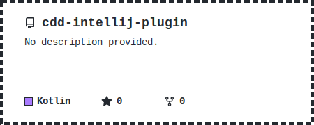
  </a>

## Java

  <a href="https://github.com/jonasalessi/stock-prices-monitor">
    
  </a>
  <a href="https://github.com/jonasalessi/travelsalesman">
    
  </a>
  <a href="https://github.com/jonasalessi/EclIRC">
    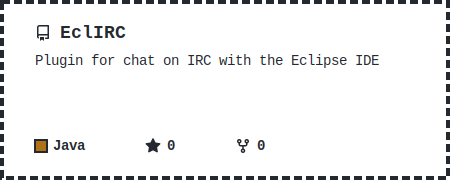
  </a>
  <a href="https://github.com/jonasalessi/minicurso_hibernate">
    
  </a>
  <a href="https://github.com/jonasalessi/walkerBoot">
    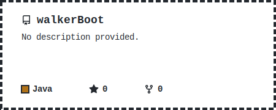
  </a>

## JavaScript
### TypeScript

  <a href="https://github.com/jonasalessi/coding-challenge-backend-c">
    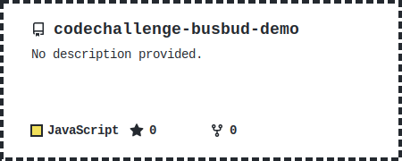
  </a>
  <a href="https://github.com/jonasalessi/shopping-cart-ddd">
    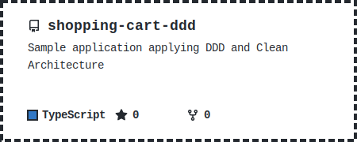
  </a>

### NodeJs/ReactJs/ReactNative

  <a href="https://github.com/jonasalessi/ecollect">
    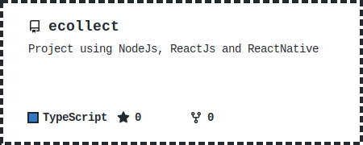
  </a>

### Games

  <a href="https://github.com/jonasalessi/quadblock">
    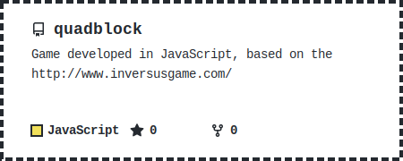
  </a>

## Go

  <a href="https://github.com/jonasalessi/go-graphQL">
    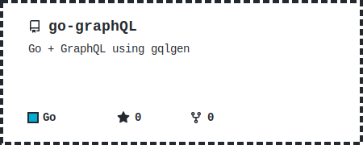
  </a>
  <a href="https://github.com/jonasalessi/go-gRPC">
    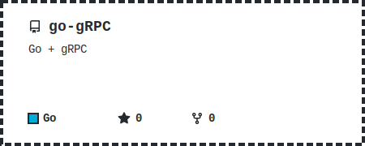
  </a>

## C

  <a href="https://github.com/jonasalessi/embedded-wind-power-plant">
    
  </a>

## AI / LLM

  <a href="https://github.com/jonasalessi/llm-plans-agents">
    
  </a>
  <a href="https://github.com/jonasalessi/playground-mcp-skills">
    
  </a>
  <a href="https://github.com/jonasalessi/skills">
    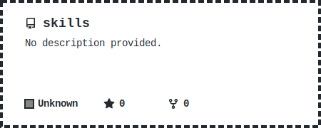
  </a>

## Observability

  <a href="https://github.com/jonasalessi/prometheus-grafana-sandbox">
    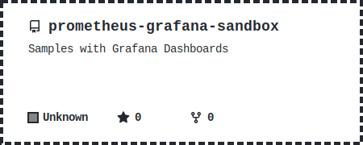
  </a>
  <a href="https://github.com/jonasalessi/apm-playground">
    
  </a>

## DevOps / CI

  <a href="https://github.com/jonasalessi/gha-actions-playground">
    
  </a>

## Open Source

  <a href="https://github.com/jonasalessi/abntex2-unoesc">
    
  </a>
  
  

